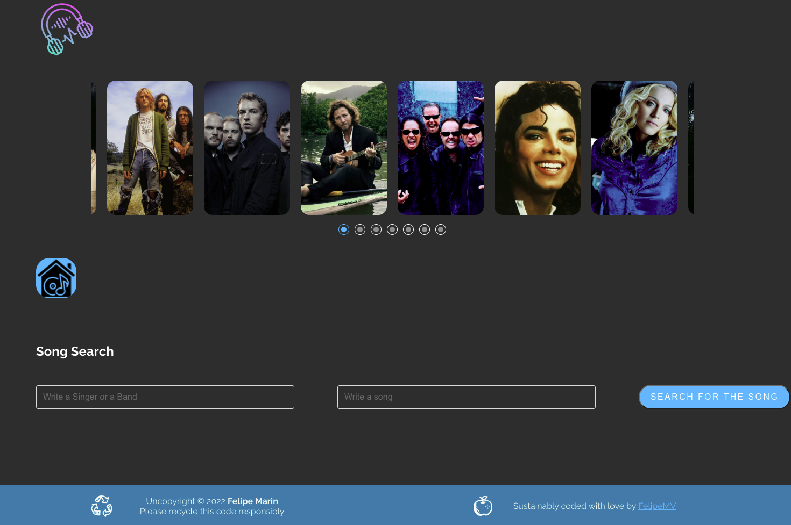

# Music Player

You can check out the link for this project: https://pipe-mv.github.io/MusicPlayer/

### What is this?

This is a repo that houses the base code for a React.js application. By the final stage of the project, the Music Player app will have a list of all the recent popular movies; a user can scroll through them, click one for more details, and save it to their favorites.

## Clone the repository

### Create a .env file inside the main directory

1. Create a .env file just like .env-sample file
2. Take your Application Key from (https://developers.google.com/youtube/v3) website (sign up for the API and then you will get the necessary id and key for the .env) and fill out the variable with the name REACT_APP_YOUTUBE_API_KEY in the .env file.

Then run:

#### "npm install"

Finally, run:

#### "npm run start"
