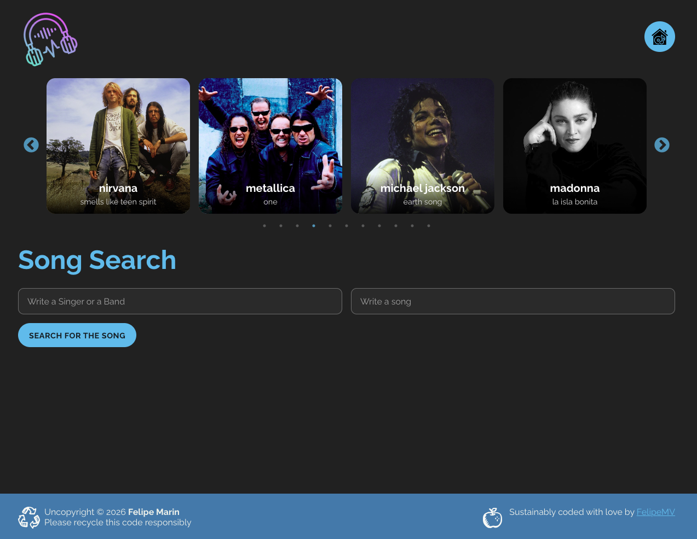

# MusicPlayer

A responsive React and TypeScript application for discovering music. Search by
artist and song to watch matching YouTube videos, read lyrics, learn about the
artist, and save favourite songs for later.

[View the live application](https://pipe-mv.github.io/MusicPlayer/)



## Features

- Search for songs by artist and title.
- Watch matching videos with the embedded YouTube player.
- Read song lyrics and artist information.
- Save and remove favourite songs in browser storage.
- Browse favourites in a responsive carousel.
- Use the application across phone, tablet, and desktop screen sizes.
- Navigate directly to saved song details with client-side routing.

## Technology

- React 19
- TypeScript
- React Router
- React Player
- React Slick
- Create React App
- GitHub Actions
- GitHub Pages

## External services

MusicPlayer combines information from the following services:

- [YouTube Data API](https://developers.google.com/youtube/v3) for video search.
- [Lyrics.ovh](https://lyricsovh.docs.apiary.io/) for song lyrics.
- [TheAudioDB](https://www.theaudiodb.com/api_guide.php) for artist details.

Availability and search results depend on these external services.

## Getting started

### Requirements

- Node.js 22
- npm
- A YouTube Data API browser key

### Installation

Clone the repository and install its dependencies:

```bash
git clone https://github.com/pipe-mv/MusicPlayer.git
cd MusicPlayer
npm install
```

Create a `.env` file in the project root:

```env
REACT_APP_YOUTUBE_API_KEY=your_youtube_api_key
```

Start the development server:

```bash
npm start
```

The application will be available at
`http://localhost:3000/MusicPlayer/`.

## API key security

The YouTube key is used by a browser application and is therefore visible in
the compiled frontend. Protect it in Google Cloud by:

- Restricting the key to the YouTube Data API v3.
- Adding HTTP referrer restrictions for the production and local URLs.
- Setting API quotas and monitoring usage.
- Keeping `.env` files out of Git.

Never commit `.env` files or OAuth client-secret JSON files.

## Available commands

```bash
npm start
```

Runs the local development server.

```bash
npm run typecheck
```

Checks the TypeScript source without producing build files.

```bash
npm test -- --watchAll=false
```

Runs the test suite once.

```bash
npm run build
```

Creates an optimized production build.

## Architecture

The source uses a feature-oriented architecture. Search and favourites are
independent modules with four primary layers:

- `domain` defines feature data and types.
- `application` contains hook controllers and feature coordination.
- `infrastructure` integrates APIs and browser storage.
- `ui` contains screens and presentation components.

Shared utilities and components live under `src/shared`, while `src/app/App.tsx`
connects routes and features.

See [ARCHITECTURE.md](./ARCHITECTURE.md) for the complete structure and file
placement guidance.

## Continuous integration and deployment

Pull requests targeting `main` must pass:

- TypeScript checking
- Automated tests
- Production build verification

After changes are merged into `main`, GitHub Actions repeats the checks, builds
the application with the production YouTube API secret, and deploys the build
artifact to GitHub Pages. A failed verification prevents deployment.

## Data persistence

Favourite songs are stored in the browser's `localStorage`. They remain on the
same browser and device, but they are not synchronized between devices or user
accounts.

## Author

Created and maintained by [Felipe Marin](https://github.com/pipe-mv).
